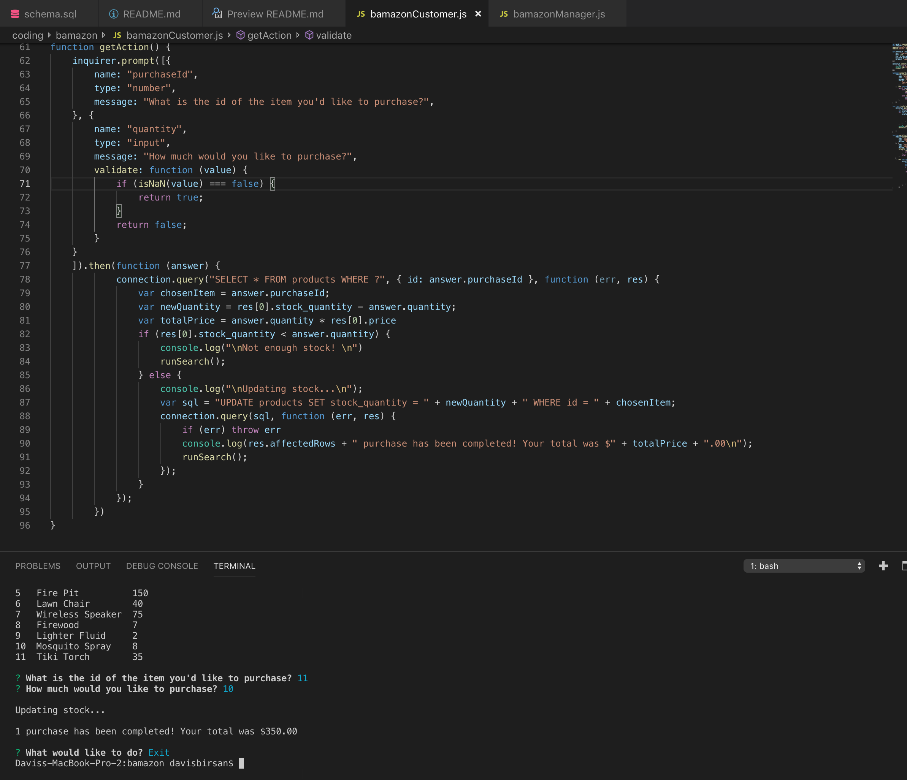
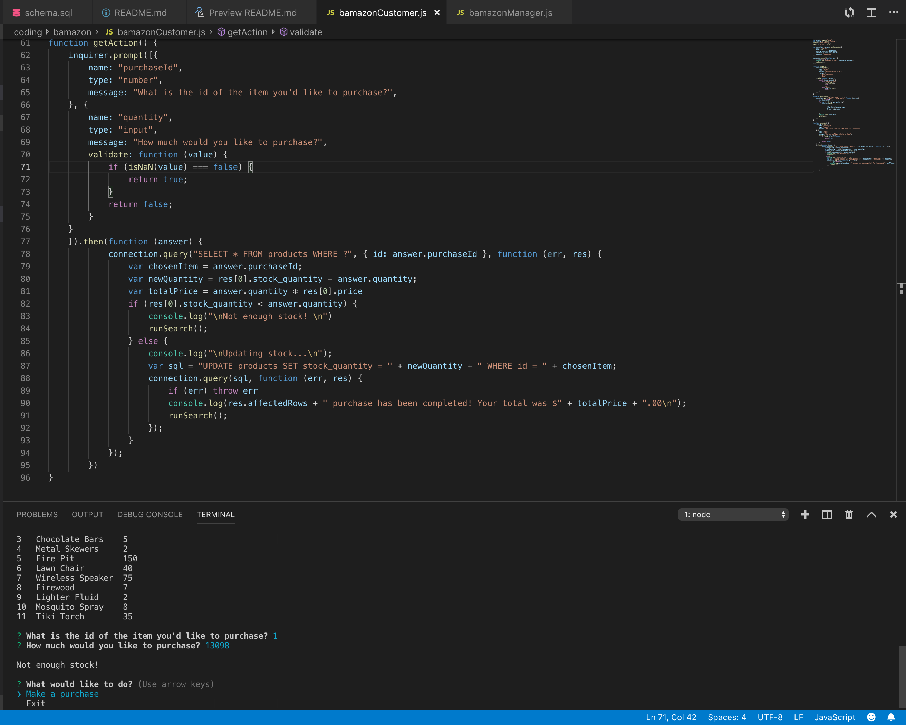
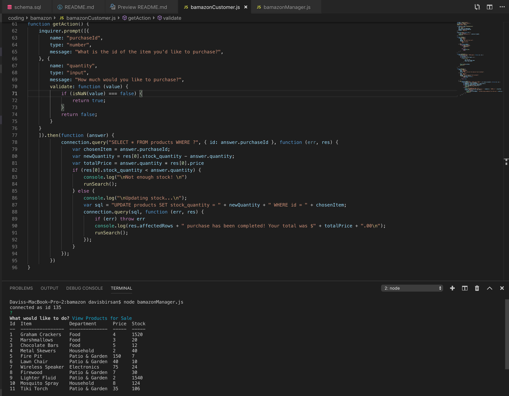
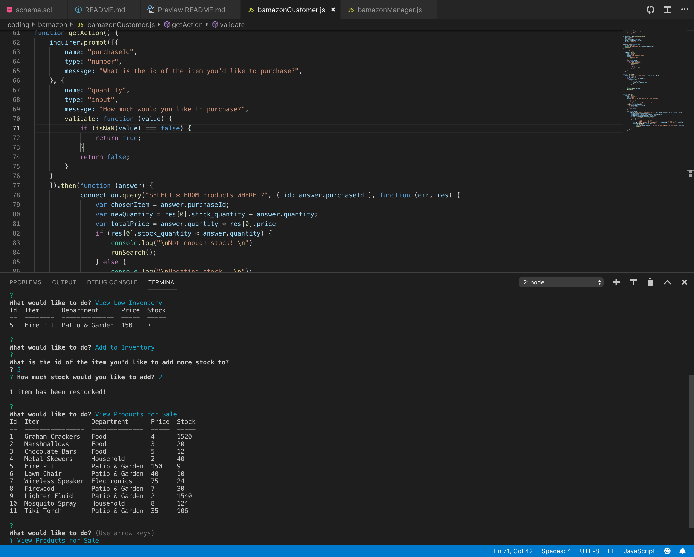
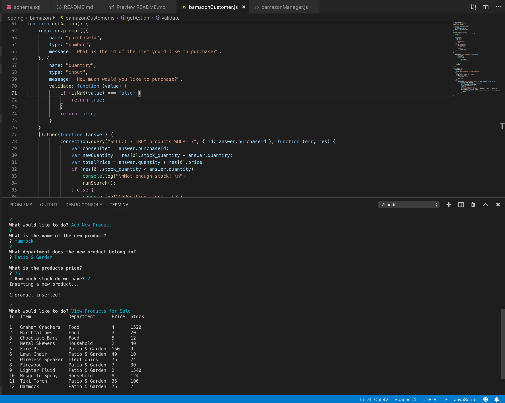

# bamazon

## Overview
Bamazon is an Amazon-like storefront that utilizes MySQL, Javascript, and Node.js. If you choose to be the customer, the app will take in your orders and deplete stock from the store's inventory. If you choose to step in the manager's shoes, the app will let you: view products for sale, view low inventory, add to inventory, and add new products.

## How it works
User (the person running the program) will enter - **node bamazonCustomer.js** OR **node bamazonManager.js** in the terminal to assume the role of a customer or a manager. 

Afterwards, the user is able to conduct mutiple actions via a series of prompts. The prompts are self explanatory, so I will let you figure out what actions you'd like to take next ;)

## Program in Action

## Technologies Used
* Javascript
* Node JS
* mySQL
* Various NPM Packages
    * dotenv npm package
    * console.table npm package
    * inquirer npm package

## Deploy GitHub Link
https://github.com/daveyjonezz/bamazon.git

## Developer
Davis Birsan
